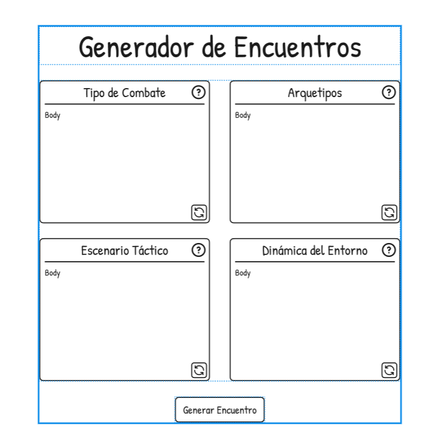
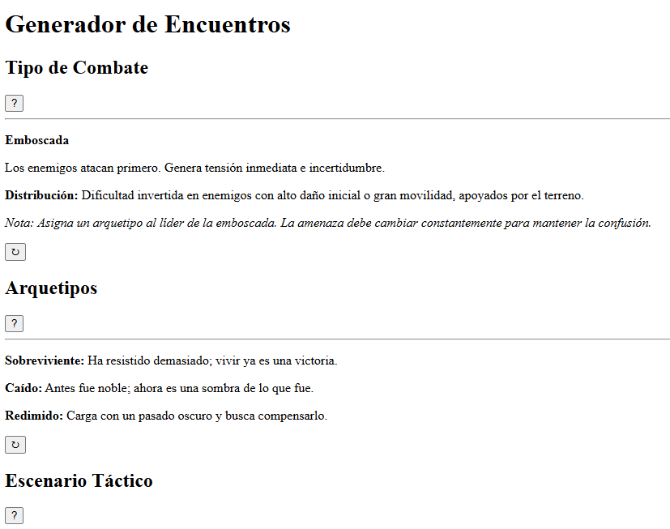
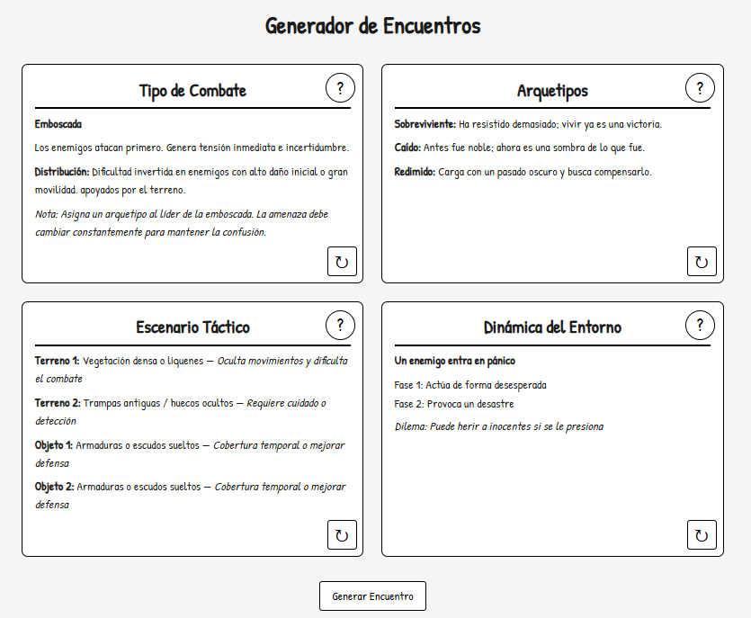

# Prácticas de React

## Introducción

Para aprender React, dediqué un día a investigar la mejor forma de aprenderlo. Un día dedicado a hacer las cosas bien es mejor que 3 meses haciendo las cosas mal.
*“Si tuviera seis horas para talar un árbol, pasaría las cuatro primeras afilando el hacha” - Desconocido*

Esto me ayudó mucho ya que mi primer impulso fue buscar un curso para tener un título en mi curriculum.
Pero todo el mundo decía lo mismo: 

- Es mejor la documentación oficial.
- No necesitas un título, necesitas demostrar que sabes React.
- Es mejor tener un buen portfolio de proyectos

No es lo mismo ver una plantilla de Canva que ponga "sé de React" que ver una página web bien diseñada como curriculum.

Los primeros pasos fue ir paso por paso navegando la documentación oficial hasta que tenía suficiente base para empezar a hacer proyectos.
Se aprende más haciendo proyectos igualmente, ya iría aprendiendo cosas específicas conforme me hicieran falta.

## Proyectos

Tenía muchas ideas para proyectos futuros, pero quería ir subiendo la dificultad poco a poco hasta acabar con una aplicación completa.
Dado mi interés en los juegos de rol y el querer como gran projecto hacer una web para gestionarlos, empecé con una herramienta de apoyo.

### Generador de Encuentros

Para empezar quería hacer la app "pensando en React", pero antes del desarrollo, va el **Diseño.**
Así que abrí Figma y empecé a "componer" una idea limpia y bonita para una interfaz.

Boceto en Figma:

Ahora sí podía empezar con la programación. Primero, tenía que implementar la web estática, sin estilos ni nada, simplemente estructura.

Luego aplicar los estilos para replicar el boceto de Figma y finalmente añadir toda la funcionalidad mediante hooks.

Esto marca el fin del primer proyecto. Lo siguiente es crear una forma de acceder a todos los que vaya haciendo, lo más apropiado y que quería saber era hacer una cabecera común con el estilo de la comunidad de rol.

### Cabecera

## Rol Granada y Supabase

El cliente usa `VITE_SUPABASE_URL` y `VITE_SUPABASE_ANON_KEY` desde `rolgranada-app/.env.local`. En GitHub Pages, configura esas variables en el entorno de build; la aplicación usa la base `/rolgranada/` para el callback OAuth.

Si ya tienes `profiles`, `partidas`, `partida_participantes` y `disponibilidades`, ejecuta primero `supabase/schema.sql`: añade `partidas.notas_dm`, crea `sesiones` si falta, agrega `sesiones.imagen_url` y configura el bucket de imágenes. Después ejecuta `supabase/rls.sql`, que configura RLS, corrige autoinscripciones DM antiguas, crea los RPC y recarga el caché de PostgREST. Reejecuta ambos scripts tras estos cambios.

La navegación y el catálogo son anónimos. Al crear o unirse a una campaña, o guardar disponibilidad, se solicita iniciar sesión. En **Authentication → Providers**, habilita **Email**. Si la confirmación de correo está activa, los usuarios deberán abrir el enlace que reciben antes de entrar. Para producción, configura SMTP propio para que Supabase pueda entregar esos correos de forma fiable.

En **Authentication → URL Configuration**, establece la URL del sitio y añade estas redirecciones permitidas:

- `http://localhost:5173/rolgranada/`
- `https://dungeoncat.site/rolgranada/`

Google OAuth queda como opción adicional: si quieres conservarlo, habilítalo en **Providers → Google** y configura el callback que indica Supabase en la consola de Google. Para asignar `admin`, cambia `profiles.role` desde el SQL Editor; la aplicación no permite que cada usuario eleve su propio rol.

## Variables de despliegue

Configura `VITE_SUPABASE_URL` y `VITE_SUPABASE_ANON_KEY` en `rolgranada-app/.env.local` para desarrollo y como variables del build de GitHub Pages. No publiques `.env.local` ni uses la clave `service_role` en el frontend; Email Auth no necesita secretos adicionales.
